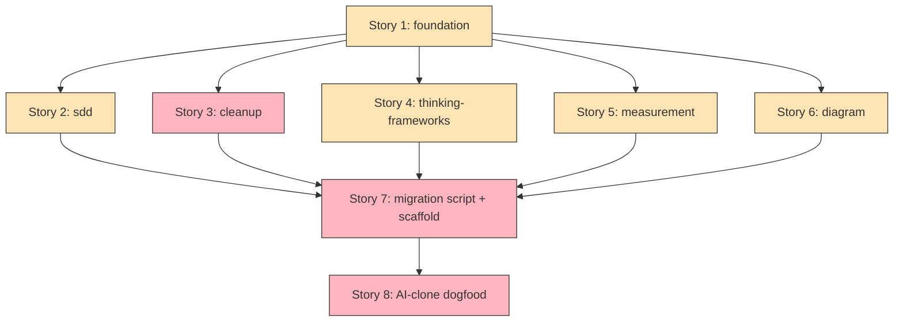

# pentaglyph operational layer の Claude Code plugin 化ロードマップ

| メタ情報         | 値                                                                                                                                                                                          |
| ---------------- | ------------------------------------------------------------------------------------------------------------------------------------------------------------------------------------------- |
| 作成日           | 2026-05-23                                                                                                                                                                                  |
| 有効期限（目安） | 2026-07-31（Story 1-6 完了 + reference consumer 1 件で dogfood 完了想定）                                                                                                                   |
| ステータス       | 📋 Draft（PoC 検証完了、ADR-0013 Proposed と並走、PO 承認待ち）                                                                                                                              |
| 親 ADR           | [ADR-0013](../arc42/09-decisions/0013-adopt-claude-code-plugin-packaging.md) — 6 plugin 分割の採用判断                                                                                       |
| 関連 ADR         | [ADR-0001](../arc42/09-decisions/0001-adopt-five-layer-self-architecture.md) (5+1 層) / [ADR-0002](../arc42/09-decisions/0002-bind-canons-only-no-self-authored-standards.md) (bind-canons-only) |
| 関連 impl-plan   | [2026-05-16_layer-prefixed-directories-migration.md](./2026-05-16_layer-prefixed-directories-migration.md)（直前の構造改革。本 plan はその上で operational layer の配布形態を変える）        |
| 影響範囲         | pentaglyph upstream（kit 本体の `.claude/skills/` `.claude/agents/` を新 git repo に切り出し）+ 全 downstream consumer（subtree pull 範囲が縮小 + plugin install 必要）                       |
| 起票者           | Yu (PO) + Claude Code 補助                                                                                                                                                                  |
| AI-clone downstream binding | Feature: [AB#2331](https://dev.azure.com/ai-clone/ai-clone/_workitems/edit/2331) / Phase 0 paperwork US: [AB#2332](https://dev.azure.com/ai-clone/ai-clone/_workitems/edit/2332) (Tasks: [AB#2333](https://dev.azure.com/ai-clone/ai-clone/_workitems/edit/2333) / [AB#2334](https://dev.azure.com/ai-clone/ai-clone/_workitems/edit/2334) / [AB#2335](https://dev.azure.com/ai-clone/ai-clone/_workitems/edit/2335)) |

---

## 0. TL;DR

[ADR-0013](../arc42/09-decisions/0013-adopt-claude-code-plugin-packaging.md) の決定を実装する。`.claude/skills/` + `.claude/agents/` を **6 plugin に分割** して Claude Code plugin として配布する。`.claude/rules/` と `docs/` scaffold は subtree のまま残す (rule は plugin に乗らない、ADR-0013 §Decision Drivers §1)。

| Plugin | 中身 | 依存 |
| --- | --- | --- |
| `pentaglyph-foundation` | tour + explain skills + tour-guide agent | — |
| `pentaglyph-sdd` | doc-init/fill/status skills + 7 SDD agents (doc-orchestrator + discovery + completeness-auditor + architect + adr-writer + spec-writer + impl-plan-writer + prd-writer) | foundation |
| `pentaglyph-cleanup` | /cleanup skill + cleanup-orchestrator agent + SessionStart hook (option) | foundation |
| `pentaglyph-thinking-frameworks` | /think skill (9 framework selector) | foundation |
| `pentaglyph-measurement` | /measure skill + bin/ wrappers | foundation |
| `pentaglyph-diagram` | /diagram-render skill | foundation |

> **Pre-flight 要件**: ADR-0013 が `Accepted` に PO 承認で昇格していること。Proposed のまま着手しない。

---

## 0.5 PoC 検証スナップショット — 2026-05-23 時点

セッション 2026-05-23 で以下が完了している (PoC artefacts は `/tmp/pentaglyph-poc/` 配下、commit はまだしていない):

- [x] **Claude Code v2.1.146 plugin spec を WebFetch で完全取得** — [code.claude.com/docs/en/plugins](https://code.claude.com/docs/en/plugins) + [/plugins-reference](https://code.claude.com/docs/en/plugins-reference)
- [x] **未確認点 2 件の解消**:
    - rule auto-load: ❌ plugin は `rules/` を ship できない (manifest schema に該当フィールド無し、`CLAUDE.md` も plugin root から読み込まれない)
    - plugin-to-plugin 依存: ✅ `"dependencies": [{"name": "...", "version": "~0.1.0"}]` で semver 解決、`claude plugin enable` で transitive 解決、`claude plugin prune` で orphan 除去
- [x] **PoC plugin 3 件作成 + validate --strict 通過**:
    - `pentaglyph-diagram` (skill 1) ← 単一 skill の最小構成検証
    - `pentaglyph-foundation` (skill 2 + agent 1) ← root dependency 検証
    - `pentaglyph-sdd` (skill 3 + agent 8 + `dependencies: pentaglyph-foundation ~0.1.0`) ← 依存解決検証
- [x] **依存解決の挙動確認**: `--plugin-dir A --plugin-dir B` で両方 load → sdd 単体 load では `dependency-unsatisfied` で silently 拒否 (debug log でのみ可視)
- [x] **agent frontmatter 全件互換確認**: pentaglyph upstream の 8 agents (architect / adr-writer / completeness-auditor / discovery / doc-orchestrator / impl-plan-writer / prd-writer / spec-writer + tour-guide) はすべて plugin 許容フィールドのみ (name / description / model / tools)

PoC で発見された **設計上の caveat 3 件** (Story 設計で対応する):

1. **silent dependency failure** — `--plugin-dir` 経由の load で依存不在は debug log 止まり、stderr に出ない。各 plugin の README に依存を明示 + migration script で settings.json への `enabledPlugins` 列挙を自動化することで緩和
2. **namespacing 必須** — `/doc-init` → `/pentaglyph-sdd:doc-init` に skill 名が変わる。downstream consumer の `CLAUDE.md` や cross-reference の update が必要
3. **cross-plugin agent invocation 未検証** — `doc-orchestrator` が `Task` で `architect-agent` / `adr-writer` を呼ぶ pattern は **同一 plugin 内** なので safe。将来別 plugin の agent を呼ぶ pattern が出たら検証が必要

---

## 1. 背景・動機

[ADR-0013 §Context](../arc42/09-decisions/0013-adopt-claude-code-plugin-packaging.md#context-and-problem-statement) で詳述しているため要約のみ:

1. pentaglyph は今まで `.claude/` を 1 つの subtree bundle として配布してきた。consumer が「SDD だけ欲しい / diagram-render だけ欲しい」のような選択的採用ができない
2. fork-and-strip パターンが早期 adopter で観測されている (consumer が不要な部分を手動削除する)
3. Claude Code v2.1.x で plugin システムが安定化し、まさにこの「`.claude/` artefact の selective adoption」を解決する目的で設計されている
4. plugin marketplace (`claude-plugins-official` + `claude-community`) を経由した discoverability が手に入る

これらは 2026-05-23 セッションで PoC 検証によって裏付けられた。

---

## 2. 範囲とゴール

### スコープ内 (本 plan で扱う)

- pentaglyph upstream の `.claude/skills/` 6 件 + `.claude/agents/` 9 件 を 6 plugin に再編
- 各 plugin の git repo 切り出し (1 plugin = 1 git repo、`claude plugin tag` で release tag を打つ)
- pentaglyph init scaffold の更新 (`.claude/settings.json` template に `enabledPlugins` を追加、`.claude/skills/` `.claude/agents/` を template から削除)
- migration script (`pentaglyph migrate-to-plugins`) — 既存 subtree consumer の `.claude/skills/` `.claude/agents/` を安全に剥がす
- AI-clone reference consumer での dogfood (Story 7)
- user manual / `STRATEGY.md` / `docs/AI_INSTRUCTIONS.md` の plugin install 手順への書き換え

### スコープ外 (別 plan で扱う)

- `.claude/rules/` の plugin 化 (ADR-0013 §Decision Drivers §1 で禁止確定済み、永久に scope 外)
- `docs/` scaffold の plugin 化 (plugin は project root にファイルを撒けない、永久に scope 外)
- `pentaglyph-binding-ado` / `pentaglyph-binding-github` (downstream binding plugin) — 別 plan で AI-clone 側で起票
- marketplace 公開 (`claude-community` 提出) — Story 8 として将来 plan に切り出す。本 plan は **private marketplace + 直接 install** までで完了
- `pentaglyph-cleanup` 内の `claim_lock.sh` の shared 化 — AI-clone 側に同名のものがあり、上流化判断が別議論 (impl-plan-writer 関連の 2026-05-22_cleanup-governance.md と整合させる必要あり)

---

## 3. Story 一覧 (ADR-0045 1:1 binding に従って 1 Story = 1 plugin)

各 Story = 1 plugin の切り出し作業。Story 6 件 + Migration Story 1 件 + Dogfood Story 1 件の計 **8 Story**。

> **ADR-0045 binding 補足**: pentaglyph upstream は ADO を使わないため、Feature ↔ Story ↔ User Story の 4 階層 binding は AI-clone downstream 適用時に効く。upstream では Story = GitHub Issue (or pentaglyph 内部の equivalent) として扱う。

### Story 1: `pentaglyph-foundation` plugin の git repo 切り出し

**ADO**: AI-clone 適用時に AB# を発番 (本 plan upstream 段階では unbind)
**親 ADR**: [ADR-0013](../arc42/09-decisions/0013-adopt-claude-code-plugin-packaging.md)
**SP 見積 (rubric)**: 3 SP

**作業内容**:
- 新規 git repo `pentaglyph-foundation` を作成
- `pentaglyph upstream .claude/skills/tour/SKILL.md` → 新 repo `skills/tour/SKILL.md`
- `pentaglyph upstream .claude/skills/explain/SKILL.md` → 新 repo `skills/explain/SKILL.md`
- `pentaglyph upstream .claude/agents/tour-guide.md` → 新 repo `agents/tour-guide.md`
- `.claude-plugin/plugin.json` (PoC 内容を流用) + `README.md` + `LICENSE` (MIT) + `CHANGELOG.md` を作成
- `claude plugin validate --strict` 通過確認
- `claude plugin tag --push` で `pentaglyph-foundation--v0.1.0` を打つ

**完了条件 (AC)**:
- ☐ plugin validate strict pass
- ☐ git tag `pentaglyph-foundation--v0.1.0` push 完了
- ☐ `claude --plugin-dir <repo>` で load 確認 (tour + explain + tour-guide 3 component visible)

### Story 2: `pentaglyph-sdd` plugin の git repo 切り出し

**SP 見積**: 5 SP (最大 plugin、依存解決検証込み)

**作業内容**:
- 新規 git repo `pentaglyph-sdd` を作成
- `.claude/skills/{doc-init,doc-fill,doc-status}` → `skills/<name>/SKILL.md` (3 件)
- `.claude/agents/{doc-orchestrator,discovery-agent,completeness-auditor,architect-agent,adr-writer,spec-writer,impl-plan-writer,prd-writer}` → `agents/<name>.md` (8 件)
- `.claude-plugin/plugin.json` に `"dependencies": [{"name": "pentaglyph-foundation", "version": "~0.1.0"}]` を含める
- `claude plugin validate --strict` 通過確認
- `claude --plugin-dir foundation --plugin-dir sdd` で load 確認 (transitive 解決)
- `claude --plugin-dir sdd` 単体で **意図的に load 失敗** することを確認 (silently 拒否、debug log で `dependency-unsatisfied` 確認)
- `claude plugin tag --push pentaglyph-sdd--v0.1.0`

**完了条件 (AC)**:
- ☐ plugin validate strict pass
- ☐ foundation + sdd 並列 load で 3 skills + 8 agents 全 visible
- ☐ sdd 単体 load で silently 拒否 (debug log で `dependency-unsatisfied` line を grep 確認)
- ☐ git tag push 完了

### Story 3: `pentaglyph-cleanup` plugin の git repo 切り出し

**SP 見積**: 3 SP

**作業内容**:
- 新規 git repo `pentaglyph-cleanup` 作成
- AI-clone downstream で先行実装されている `.claude/skills/cleanup/SKILL.md` (6 subcommand) + `cleanup-orchestrator.md` agent を pentaglyph upstream に逆 export してから切り出し (順序: 逆 export PR → upstream merge → plugin repo 切り出し)
- 任意で `hooks/hooks.json` に SessionStart claim-sweep hook を含める (option)
- depends on `pentaglyph-foundation ~0.1.0`
- `bin/claim_lock.sh` を shared helper として bundle (現 AI-clone の `_shared/claim_lock.sh` から汎用部分を抽出)

**完了条件 (AC)**:
- ☐ AI-clone 側の cleanup skill + agent を upstream に逆 export 完了
- ☐ plugin repo 切り出し + tag push 完了
- ☐ `claude --plugin-dir foundation --plugin-dir cleanup` で `/pentaglyph-cleanup:cleanup` 6 subcommand visible

**注意**: 本 Story は AI-clone 側の cleanup 実装の upstream 化を含むため、AI-clone PO との調整が必要。pentaglyph 上流が cleanup を持っていない現状を Story 内で先に解消する。

### Story 4: `pentaglyph-thinking-frameworks` plugin の新規実装 + 切り出し

**SP 見積**: 3 SP

**作業内容**:
- 現状 pentaglyph upstream は thinking-frameworks の docs (`docs/02-process/thinking-frameworks/`、ADR-0011 で Accepted) のみで skill は無い。本 Story で **skill 自体を新規実装**
- `/think <framework>` skill を新規作成 (9 framework: MECE / Issue Tree / First Principles / Hypothesis-Driven / 5 Whys / Pareto / 2x2 / OODA / Minto SCQA)。各 framework の 1-liner instruction を embed
- depends on `pentaglyph-foundation`
- ADR-0011 で確立された docs (`docs/02-process/thinking-frameworks/_foundation-mece.md` 等) への back-link を skill description に含める

**完了条件 (AC)**:
- ☐ /think skill 新規 SKILL.md 作成
- ☐ 9 framework すべて 1-liner instruction + docs link 込み
- ☐ plugin tag push 完了

### Story 5: `pentaglyph-measurement` plugin の git repo 切り出し

**SP 見積**: 3 SP

**作業内容**:
- 現状 pentaglyph upstream の Layer ⑤ Measurement は `docs/05-measurement/` + `scripts/` + Bun CLI に分散実装 (ADR-0009 で Accepted)。本 Story で skill + bin 化
- `/measure` skill (lizard CCN + OpenAPI drift + schemathesis baseline) を新規作成 (AI-clone 側の `.claude/skills/measure/` を参照して upstream 化)
- `bin/lizard-wrapper` / `bin/schemathesis-wrapper` を plugin の `bin/` 配下に置き、`${CLAUDE_PLUGIN_ROOT}` で参照
- depends on `pentaglyph-foundation`

**完了条件 (AC)**:
- ☐ /measure skill upstream 化
- ☐ bin/ wrapper 動作確認 (`claude --plugin-dir` で enable し PATH 通過確認)
- ☐ plugin tag push 完了

### Story 6: `pentaglyph-diagram` plugin の git repo 切り出し

**SP 見積**: 2 SP (PoC 既に存在、最小作業)

**作業内容**:
- PoC で作成済みの `/tmp/pentaglyph-poc/pentaglyph-diagram/` を新規 git repo 化
- `pentaglyph upstream .claude/skills/diagram-render/SKILL.md` から最新版を再 sync
- depends on `pentaglyph-foundation`
- `claude plugin tag --push pentaglyph-diagram--v0.1.0`

**完了条件 (AC)**:
- ☐ plugin tag push 完了
- ☐ AI-clone reference consumer で `/pentaglyph-diagram:diagram-render` 経由で既存 `.dsl` を render できることを確認

### Story 7: Migration script + pentaglyph init scaffold 更新

**SP 見積**: 5 SP

**作業内容**:
- `pentaglyph migrate-to-plugins` CLI コマンド (Bun script) を作成。動作:
    1. 既存 `.claude/skills/<6 件>` と `.claude/agents/<9 件>` を削除
    2. `.claude/rules/` と `docs/` には触らない
    3. `.claude/settings.json` の `enabledPlugins` 配列に 6 plugin を列挙 (project scope)
    4. dry-run mode を default、`--apply` で実行
- `pentaglyph init` (scaffold コマンド) を更新:
    - 新規 consumer 向け template `.claude/settings.json` に `enabledPlugins` を pre-populate
    - `.claude/skills/` `.claude/agents/` ディレクトリを template から削除 (rule + docs は残す)
- migration script のユニットテスト (`scripts/tests/test_migrate_to_plugins.py` を新規追加、最低 15 シナリオ)
- `docs/AI_INSTRUCTIONS.md` + `docs/WORKFLOW.md` + user manual に plugin install 手順を追加

**完了条件 (AC)**:
- ☐ migration script dry-run 出力が AI-clone 上で正しい変更内容を提示
- ☐ migration script `--apply` 後、AI-clone session で 6 plugin の skill が namespaced で見える
- ☐ user manual に「subtree (scaffold) + plugin (operational) のハイブリッド配布モデル」を 1 章追加
- ☐ ユニットテスト全件 pass

### Story 8: AI-clone reference consumer dogfood

**SP 見積**: 3 SP

**作業内容**:
- AI-clone を最初の reference consumer として Story 7 の migration script を `--apply` で実行
- 1 週間以上の dogfood 期間で issue 拾い (skill 名 namespacing で broken link が出てないか、`CLAUDE.md` のリンクが死んでないか、`.claude/rules/` の参照 path が壊れてないか)
- 発見された issue を Story 1-7 のいずれかに follow-up commit として戻す
- AI-clone の `CLAUDE.md` のスキル一覧と cross-reference を namespaced 形に書き換え
- 完了レポートを `pentaglyph upstream docs/01-artefacts/case-studies/2026-XX-XX_first-plugin-consumer.md` に起こす

**完了条件 (AC)**:
- ☐ AI-clone session で 6 plugin の全 skill が namespaced で正常動作
- ☐ migration 前後で AI-clone の docs/コードに regression なし
- ☐ case study doc が drafted

---

## 4. 依存関係 + 並列度

[mermaid.live で開く](https://mermaid.live/)

**Critical Path**: Story 1 → Story 2 → Story 7 → Story 8 (= foundation → sdd → migration → dogfood、計 16 SP)
**並列度**: Story 1 完了後、Story 2 / 3 / 4 / 5 / 6 は **5 並列実行可能** (依存先 = foundation のみ、互いに独立)
**Total SP**: 27 SP

---

## 5. リスク + 緩和策

| ID | リスク | 確率 | 影響 | 緩和 |
| --- | --- | --- | --- | --- |
| R1 | Claude Code plugin spec が migration 中に breaking change | 中 | 高 | spec 変更を WebFetch で週次 sync、v2.1.146 を minimum supported version に pin、CHANGELOG.md で対応版を明記 |
| R2 | namespacing で downstream consumer の CLAUDE.md / docs cross-reference が大量壊死 | 高 | 中 | migration script に cross-ref 検出 dry-run mode を追加、AI-clone dogfood で先に潰す |
| R3 | silent dependency failure で consumer が「動かない」と困惑 | 中 | 中 | 各 plugin README で依存を明示、settings.json template で 6 plugin を pre-populate、migration script で正しい順序を保証 |
| R4 | Story 3 (cleanup) で AI-clone 実装の upstream 化が大型化 | 中 | 高 | Story 3 着手前に AI-clone PO + pentaglyph maintainer で scope alignment session を 1 回挟む、必要なら別 impl-plan に切り出し |
| R5 | cross-plugin agent invocation が将来必要になった時に詰む | 低 | 中 | 本 plan の範囲では cross-plugin agent invocation を発生させない設計 (SDD agents は全部 sdd plugin 内に閉じる)、将来パターンが出たら別 ADR |
| R6 | marketplace 公開フォーマットが我々の構造と乖離 | 低 | 低 | 本 plan は private marketplace + 直接 install までで完了、公開は別 plan |

---

## 6. Phase / Timeline

| Phase | 期間 (目安) | 内容 |
| --- | --- | --- |
| Phase 0 | 2026-05-23 〜 2026-05-30 | ADR-0013 PO 承認 (Proposed → Accepted)、Story 1-8 の発番 (AI-clone downstream 適用時は AB# を発番) |
| Phase 1 | 2026-05-31 〜 2026-06-13 | Story 1 (foundation) を最初に完遂、その後 Story 2 / 4 / 5 / 6 を 4 並列実行 (Story 3 はまだ着手しない) |
| Phase 2 | 2026-06-14 〜 2026-06-27 | Story 3 (cleanup) — AI-clone 実装の upstream 逆 export を含むため 1 Sprint 独立配分 |
| Phase 3 | 2026-06-28 〜 2026-07-11 | Story 7 (migration script + scaffold) — Story 1-6 完遂を前提 |
| Phase 4 | 2026-07-12 〜 2026-07-31 | Story 8 (AI-clone dogfood) + 残課題 fix + case study 起こし |

---

## 7. Phase 別アクションアイテム

### Phase 0 アクション

| # | アクション | 担当 | 完了条件 | ADO |
| -- | --- | --- | --- | --- |
| 0-1 | ADR-0013 を Proposed → Accepted に PO 承認で昇格 | PO | ADR-0013 frontmatter `status: Accepted` | — |
| 0-2 | 本 impl-plan を Draft → In Progress に flip | PO | front-matter `status: In Progress` | — |
| 0-3 | AI-clone downstream で AB# 発番 (Feature 1 + Story 8 = 9 件) — オプション、upstream 単独進行も可 | AI-clone PO | ADO ticket 起票 + link 反映 | — |

### Phase 1-4 アクション

詳細は各 Story 配下の AC を参照。各 Story は 1 PR で完結を目標 (Story 7 のみ scaffold + script + docs の 3 commit になる可能性あり)。

---

## 8. 関連リソース

- ADR-0013 (本 plan の親): [pentaglyph upstream docs/01-artefacts/arc42/09-decisions/0013-adopt-claude-code-plugin-packaging.md](../arc42/09-decisions/0013-adopt-claude-code-plugin-packaging.md)
- Claude Code plugin spec: <https://code.claude.com/docs/en/plugins>
- Claude Code plugin reference: <https://code.claude.com/docs/en/plugins-reference>
- Plugin marketplaces: <https://code.claude.com/docs/en/plugin-marketplaces>
- 関連 (直前の構造改革): [2026-05-16_layer-prefixed-directories-migration.md](./2026-05-16_layer-prefixed-directories-migration.md)
- PoC artefacts (local、commit 前): `/tmp/pentaglyph-poc/{pentaglyph-foundation,pentaglyph-sdd,pentaglyph-diagram}/`
- PoC validation log: `/tmp/plugin-debug.log` (`dependency-unsatisfied` line 含む)

---

## 9. 改訂履歴

| Version | Date | Summary |
| --- | --- | --- |
| 0.1.0 | 2026-05-23 | 初版 Draft。PoC 検証完了 + ADR-0013 と並走、Story 1-8 の SP 見積 27 SP、Phase 0-4 で 2 ヶ月想定 |
