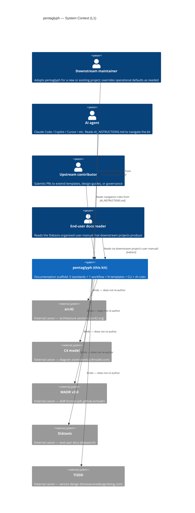
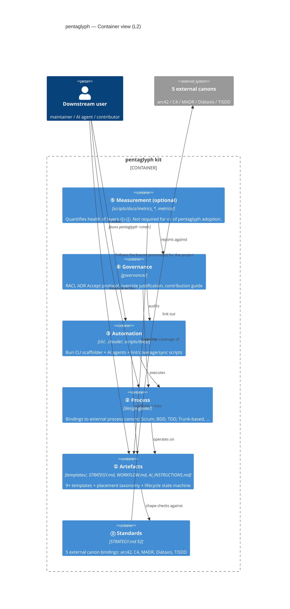

# pentaglyph self-architecture — building block view of the kit itself

> This file is **meta**: it models *pentaglyph itself* as a system using arc42 §5 + C4 L1/L2. Downstream projects rename or remove it and use this directory to model **their own** system instead.

| Metadata | Value |
| --- | --- |
| Subject | The pentaglyph documentation kit |
| Authority | [`STRATEGY.md §3`](../../STRATEGY.md) — the two-axis taxonomy this file visualises |
| arc42 section | §5 Building Block View |
| C4 levels covered | L1 (System Context) + L2 (Container) |
| Related ADRs | (forthcoming self-ADRs 1-6) |
| Linked impl-plan | [`docs/impl-plans/2026-05-14_pentaglyph-self-architecture-roadmap.md`](../../impl-plans/2026-05-14_pentaglyph-self-architecture-roadmap.md) |

---

## 1. Purpose — why model the kit itself?

Pentaglyph is a documentation kit, but it is *also* a system: it has external dependencies (five canons), internal containers (layers ⓪-⑤), users (downstream projects, AI agents, contributors), and a dependency direction. Modelling those explicitly with arc42 + C4 — the same tools the kit ships for downstream projects — closes a self-consistency gap: pentaglyph *strictly* enforces MADR + arc42 + C4 on its users but did not previously document its own decisions, containers, or scope in the same form.

This file is what closes that gap. It is intentionally short — the substantive content (concern axis, layer contracts, matrix) lives in [`STRATEGY.md §3`](../../STRATEGY.md). This file adds only the C4 zoom levels.

---

## 2. System Context — C4 L1

**Key invariant**: pentaglyph never re-authors a canon's philosophy. Every box on the right of the diagram is a URL the user is sent to. Pentaglyph adds only the *file layout* that hosts what the canons prescribe, plus the workflow that says when to write what.

---

## 3. Container View — C4 L2 (the 6 layers as containers)

### 3.1 Layer responsibilities at a glance

| Layer | Container directory | Primary responsibility | Substrate for |
| --- | --- | --- | --- |
| ⓪ Standards | `STRATEGY.md §2` | Bind canons via link-out | ① |
| ① Artefacts | `templates/`, `STRATEGY.md`, `WORKFLOW.md`, `AI_INSTRUCTIONS.md`, plus every directory under `arc42/`, `detailed-design/`, `api-contract/`, `user-manual/`, `service-design/`, `diagrams/c4/` | Concrete shapes + placement + lifecycle | ② |
| ② Process | `design-guide/` (one file per bound canon + `_binding-a-new-process.md` meta-doc) | Thin operational defaults bound to external process canons | ③ |
| ③ Automation | `cli/`, `.claude/`, `scripts/docs/` | Execute ② and operate on ① | ④ |
| ④ Governance | `governance/` | Who decides, accepts, overrides | ⑤ |
| ⑤ Measurement *(optional)* | `metrics/`, `scripts/docs/metrics_*` | Quantify ⓪-④ health | — |

Detailed responsibility contracts (DO / DON'T) live in [`STRATEGY.md §3.2`](../../STRATEGY.md).

---

## 4. Dependency direction (strict, one-way)

Each layer depends only on layers below it. This is enforced by:

1. **Layer ⓪ contains no code or workflow** — it is pure linkage to external URLs. Therefore nothing depends *down* from ⓪.
2. **Layer ① templates may reference Layer ⓪ canons** but never Layer ② operational guides.
3. **Layer ② design-guides may reference Layer ① templates** (e.g. "BDD output uses `templates/2_prd.md` Acceptance Criteria section") but never Layer ③ automation.
4. **Layer ③ automation may operate on ① + ②** but never *define* their content.
5. **Layer ④ governance audits ② + ③** but never decides their content (decisions are individual ADRs, which are Layer ① artefacts).
6. **Layer ⑤ measurement reads ⓪-④ output** but never feeds back as prescription (that is Layer ②'s role).

Violations of this direction (e.g. an automation script that redefines a template) are caught by:

- Code review against this file
- Forthcoming layer-aware lint in `scripts/docs/`
- The forthcoming `④ Governance` ADR Accept protocol

---

## 5. Override paths — how downstream projects deviate

Downstream projects override **top-down** because the dependency direction is bottom-up. The deeper the layer being overridden, the higher the cost.

| Layer to override | Cost | Mechanism | Example |
| --- | --- | --- | --- |
| ⓪ Standards | Very high | Replace `STRATEGY.md §2`; abandon the kit's identity | Adopting a non-arc42 architecture standard. **Rare.** |
| ① Artefacts | High | Replace `templates/` and `STRATEGY.md §3+`; usually means forking the kit | Switching from MADR to Y-Statement-only ADRs. **Rare.** |
| ② Process | Medium | Replace specific files under `design-guide/`; keep ⓪-① intact | Replacing Scrum with Kanban; replacing Git Flow with Trunk-Based. **Common.** |
| ③ Automation | Low | Disable / replace CLI commands or `.claude/` rules | Using Bazel instead of Bun for scaffolding. **Project-specific.** |
| ④ Governance | Low | Replace specific files under `governance/` | Stronger ADR Accept requirements for regulated industries. **Common.** |
| ⑤ Measurement | None | Skip entirely (optional layer) | Small projects that don't need dashboards. **Common.** |

Each downstream override must include a one-paragraph rationale in [`docs/design-guide/`](../../design-guide/) and **link back to the layer + this file**, so the deviation is greppable and reversible.

---

## 6. Cross-references

- [`STRATEGY.md`](../../STRATEGY.md) — the authoritative 2-axis taxonomy and concern contracts (this file's substantive parent)
- [`WORKFLOW.md`](../../WORKFLOW.md) — when to write what, where to put it, what state it goes through
- [`AI_INSTRUCTIONS.md`](../../AI_INSTRUCTIONS.md) — entry point for AI agents (will gain a §X layer-aware navigation section)
- [`../03-context-and-scope/`](../03-context-and-scope/) — C4 L1 zoom-out for downstream systems (this file does L1 for the *kit*)
- [`../09-decisions/`](../09-decisions/) — self-ADRs that justify the choices in §3-§5 of this file (forthcoming: 6 ADRs documenting Layer 0-4 + binding strategy)
- [`../../diagrams/c4/workspace.dsl`](../../diagrams/c4/workspace.dsl) — Structurizr DSL (downstream projects). The kit's own C4 lives in the Mermaid blocks above instead, because the kit is small enough not to warrant a full DSL workspace.

---

## 7. Revision history

| Version | Date | Summary |
| --- | --- | --- |
| 0.1.0 | 2026-05-14 | Initial draft — surface pentaglyph as a layered system, document C4 L1/L2 |
